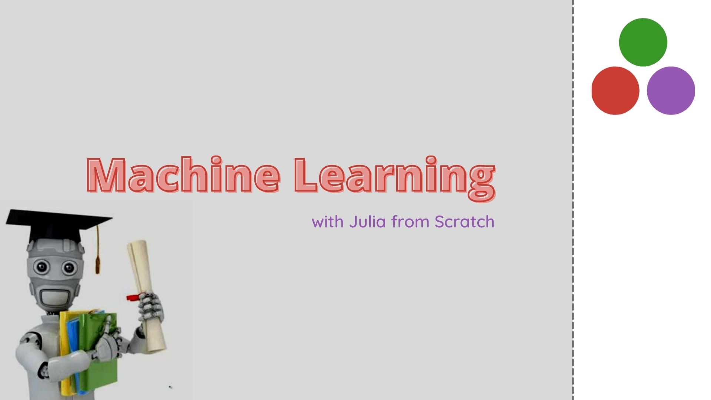

# Machine Learning from Scratch with Julia

This repository contains the implementation of common machine learning algorithms with base Julia

## About Julia

Julia is a programming language which is as fast as c or fortran but at the same time is as easy as python. It is also increasingly being used in the field of data science and scientific programming.

 
